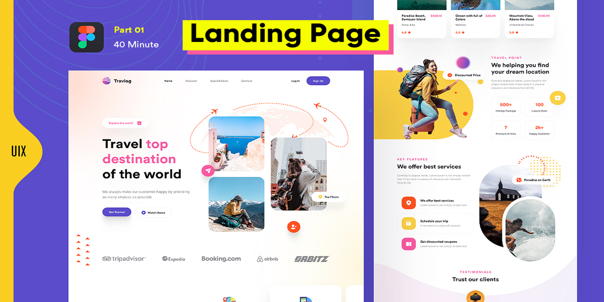

This is the source-code for honed my tailwind-css skills to convert figma to website.

### [Live site](https://travel-landing-page-liart.vercel.app/) (in development)

## Resource
### Design by [uix desing](https://www.figma.com/@uixdesign)
### Template [Responsive Web Design in Figma](https://www.figma.com/community/file/1242383980771579992/Responsive-Web-Design-in-Figma)

